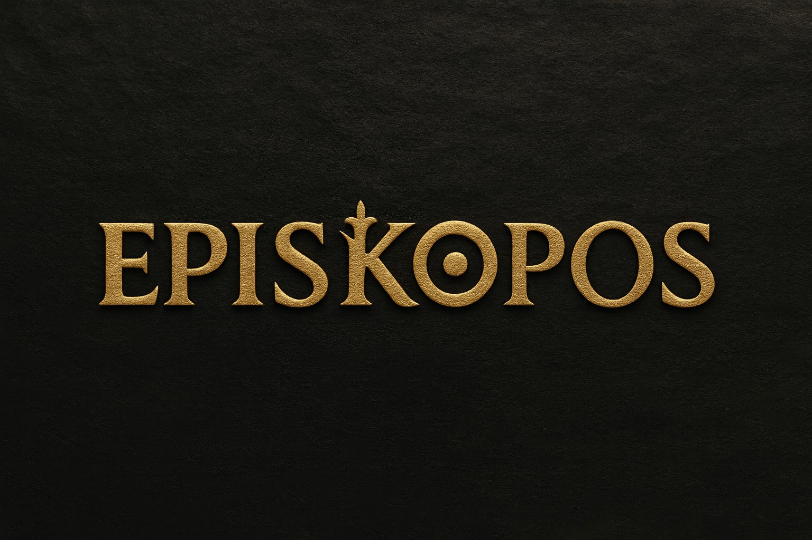

### *Oversight for Community Resilience*

---

## 📖 About

**Episkopos** (ἐπίσκοπος) is derived from the Greek words *epi-* (upon) and *skopos* (to see, watcher). It means "overseer" — one who watches over and ensures things are done correctly, functioning as a superintendent, guardian, or curator.

Our organization embodies this concept by overseeing critical systems and initiatives that strengthen communities and protect our shared future.

---

## 🎯 Our Focus Areas

We organize our work around nine interconnected pillars, each essential to building resilient, thriving communities:

<table>
<thead>
<tr>
<th width="80">Pillar</th>
<th>Focus Area</th>
<th>Description</th>
</tr>
</thead>
<tbody>
<tr>
<td align="center">⚡ <strong>E</strong></td>
<td><strong>Energy</strong></td>
<td>Sustainable energy systems and infrastructure</td>
</tr>
<tr>
<td align="center">🏥 <strong>P</strong></td>
<td><strong>Public Health</strong></td>
<td>Community health, wellness, and healthcare access</td>
</tr>
<tr>
<td align="center">🏗️ <strong>I</strong></td>
<td><strong>Infrastructure</strong></td>
<td>Essential systems and built environment</td>
</tr>
<tr>
<td align="center">🌱 <strong>S</strong></td>
<td><strong>Sustainability</strong></td>
<td>Climate action and waste management</td>
</tr>
<tr>
<td align="center">📡 <strong>K</strong></td>
<td><strong>Communications</strong></td>
<td>Community connection and information systems (<a href="https://en.wikipedia.org/wiki/Koinonia#Pre-Christian_antecedents">Koinonia</a>)</td>
</tr>
<tr>
<td align="center">🌾 <strong>⨀</strong></td>
<td><strong>Ops</strong></td>
<td>Operational abundance and resource management (<a href="https://en.wikipedia.org/wiki/Ops#Name">latin "ops"</a>)</td>
</tr>
<tr>
<td align="center">🛡️ <strong>P</strong></td>
<td><strong>Protection</strong></td>
<td>Safety, security, and emergency preparedness</td>
</tr>
<tr>
<td align="center">🤝 <strong>O</strong></td>
<td><strong>Organization</strong></td>
<td>Governance, coordination, and community structures</td>
</tr>
<tr>
<td align="center">🌾 <strong>S</strong></td>
<td><strong>Soil</strong></td>
<td>Agriculture, food systems, and land stewardship</td>
</tr>
</tbody>
</table>

---

## 🤝 Get Involved

We're building something meaningful together. Whether you're passionate about sustainability, infrastructure, public health, or community organizing — there's a place for you here.

- **Contribute**: Check out our repositories and open issues
- **Connect**: Join the conversation and share your expertise
- **Collaborate**: Help us oversee and strengthen our communities

---

*Watching over what matters, together.*

